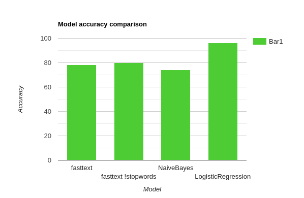

# nlp_flipkart
ML models made to predict the product class based on it's text description.  
This repository contains 4 ML Models that are used to classify products under a primary category using it's description.
The dataset used here is from the ecommerce giant Flipkart, the link to which is: https://docs.google.com/spreadsheets/d/1pLv0fNE4WHokpJHUIs-FTVnmI9STgog05e658qEON0I/edit?usp=sharing

## Getting started
These instructions will get you a copy of the project up and running on your local machine for development and testing purposes.

### Prerequisites
[](https://www.python.org/)
[](https://pandas.pydata.org/)
[](https://docs.python.org/3/library/csv.html)
[](https://fasttext.cc/)
[](https://pypi.org/project/gensim/)
[](https://scikit-learn.org/stable/index.html)
[](https://www.nltk.org/)

### Installing
Install python from this link according to your system: 
https://www.python.org/downloads/  
Install the above mentioned libraries using pip
```
pip3 install pandas python-csv fasttext gensim scikit-learn nltk

```
## The models
To build the model, open the desired notebook and run all the cells. Each fragment of the code has an explanation along with it.
### 1) Fasttext
This is a text classification library developed by facebook used to particularly label texts.  
The model yields an accuracy of 78 percent in 100 epochs given the size of the dataset.
### 2) Fasttext_!stopwords
The difference between this and the previous model is that for this model the data has first quantized followed by the removal of stopwords such as "the", "of", "an" etc to minimise clutter in the dataset.  
This change pumped up the model accuracy to 80.08 percent.
### 3) Naive Bayes
This model uses the Bayes theorum at it's core to classify the descriptions. Here also stopword removal is done followed by the creation of a vocabulary to map the description text to be fed to the classification model.  
This model yields an accuracy of 74.32 percent.
### 4) Logistic Regression
Logistic regression model seems to be the one of the most basic algorithms used in machine learning. Here I haven't fed the model with data having it's stopword removed. 
This model yields the best accuracy amongst the rest. It yields an accuracy of 96.14 percent.

## Comaprison Graph


### What other approach I could have used?
One approach that I think could work is if we are not bound to use the description as the main feature, and instead we focus on the product image. Using ImageGenerator, we could train our network to classify product based on the images. This wouldn't be very cheap on the storage or time but yes it could yield a good accuracy I beleive.

## Bibliography
https://fasttext.cc/docs/en/supervised-tutorial.html  

www.stackoverflow.com
